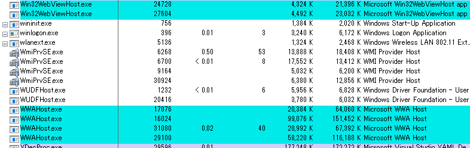
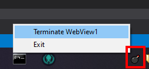

# WebView1 terminator

# What's this?

Windows [WPF WebView1 (Legacy Edge-based web browser components)](https://github.com/windows-toolkit/WindowsCommunityToolkit) stub process terminator utility.

The component invoke background proxy-stub processes named "Win32WebViewHost.exe" and "WWAHost.exe". It will turn to zombie each if crash hosted (our) application process, and they cause heavy loading CPU cycles!

This utility will terminate all WebView1 zombie processes (included not zombies :) You have to understand when use it.)

# How to use

Easy, double-click system tray icon or click context menu.

# License

Apache-v2
